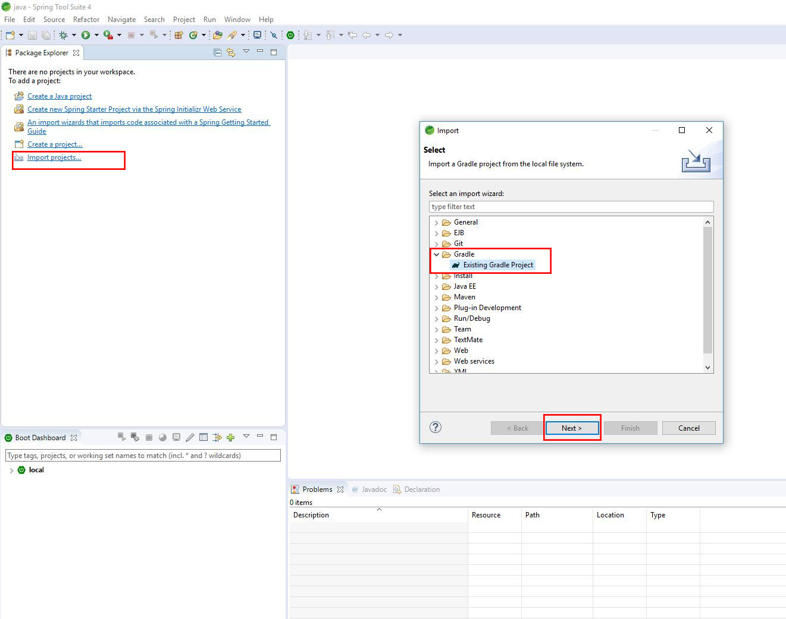
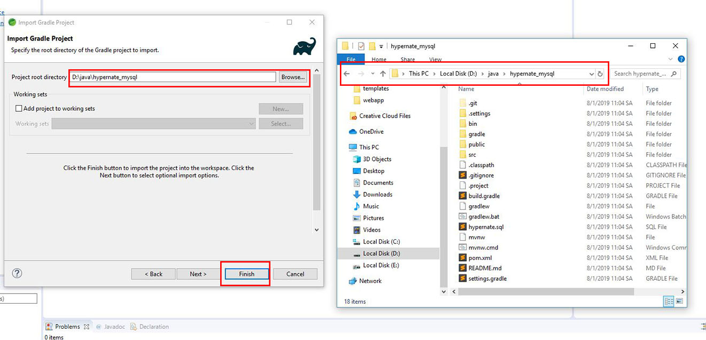
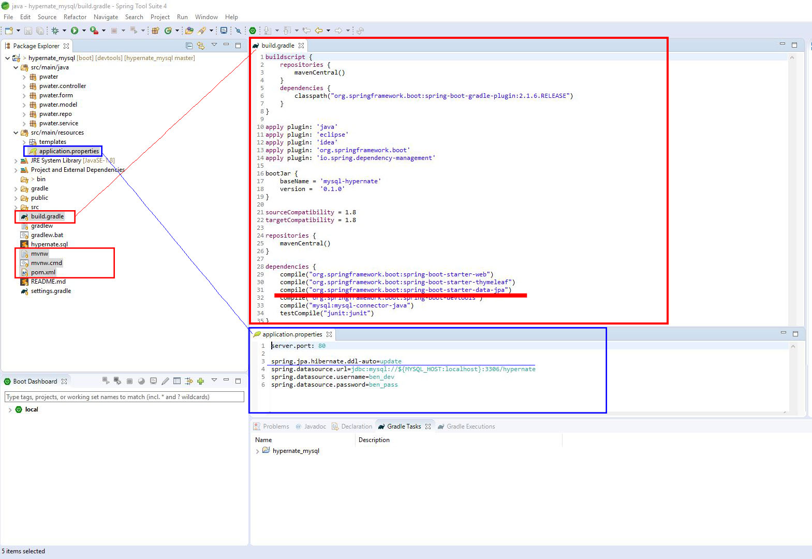
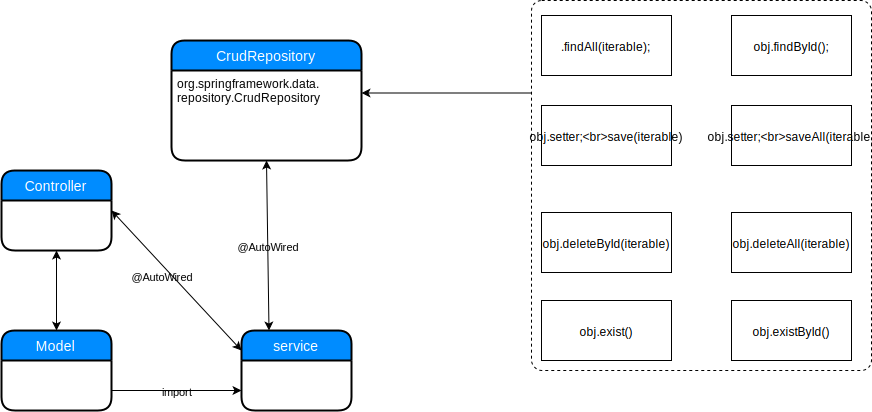

# Overview
*	[Import application](#markdown-header-import-application)
*	[Spring MVC vs Spring boot](#markdown-header-spring-mvc-vs-spring-boot)
*	[hibernate flow](#markdown-header-hibernate-flow)
*	[App flow](#markdown-header-app-flow)

# Import application

git clone https://Lampart_Thai_Huy_Binh@bitbucket.org/Lampart_Thai_Huy_Binh/hypernate_mysql.git 

+		Clone git source into folder.
+		Open __Spring tool suite__ select workspace is *hypernate_mysql*'s parent folder path.
+		On IDE screen select __Import__.
+		On __Import__ tab > choose __Gradle/Existing Gradle Project__ then click __Next__ in two times.
+		On __Import Gradle Project__ tab at __project root directory__ bar click __Browse..__
+		Select *hypernate_mysql* folder path which you just extract git url then click Finish as below picture.

# Spring MVC vs Spring boot

Here is some main point which differentiate Spring and Spring Boot :

## Spring :

1. 	Main Difference is "Test-ability".
2. 	Spring come with the DI and IOC. Through which all hard-work done by system we don't need to do any kind of work(like, normally we define object of class manually but through Di we just annotate with @Service or @Component - matching class manage those).
3. 	Through @Autowired annotation we easily mock() it at unit testing time.
4. 	Duplication and Plumbing code. In JDBC we writing same code multiple time to perform any kind of database operation Spring solve that issue through Hibernate and ORM.
5. 	Good Integration with other frameworks. Like Hibernate, ORM, Junit & Mockito.

## Spring Boot :

1. 	Create of Quick Application so that, instead of manage single big web application we divide them individually into different Microservices which have their own scope & capability.
2. 	Auto Configuration using Web Jar : In normal Spring there is lot of configuration like DispatcherServlet, Component Scan, View Resolver, Web Jar, XMLs. (For example if I would like to configure datasource, Entity Manager Transaction Manager Factory). Configure automatically when it's not available using class-path.
3. 	Comes with Default Spring Starters, which come with some default Spring configuration dependency (like Spring Core, Web-MVC, Jackson, Tomcat, Validation, Data Binding, Logging). Don't worry about versioning issue as well.
Note : It doesn't contain all point.

# Spring MVC khác với Spring boot 

Spring: 

1.	Sự khác biệt chính là "Khả năng kiểm tra". 
2.	Spring đến với DI và IOC. Thông qua đó tất cả các công việc khó khăn được thực hiện bởi hệ thống, chúng tôi không cần thực hiện bất kỳ loại công việc nào (như, thông thường chúng tôi xác định đối tượng của lớp theo cách thủ công nhưng thông qua Di, chúng tôi chỉ chú thích với @Service hoặc @Component - lớp phù hợp quản lý các lớp đó). 
3.	Thông qua chú thích @Autowired, chúng tôi dễ dàng giả định () nó tại thời điểm thử nghiệm đơn vị. 
4.	Sao chép và lập Hệ thống code. Trong JDBC, chúng tôi viết cùng một mã nhiều lần để thực hiện bất kỳ loại hoạt động cơ sở dữ liệu nào Giải quyết vấn đề đó thông qua Hibernate và ORM. 
5. 	Tích hợp tốt với các frameworks khác. Như Hibernate, ORM, Junit & Mockito. 

Spring Boot: 

1.	Tạo ứng dụng nhanh để thay vì quản lý một ứng dụng web lớn duy nhất, chúng tôi chia chúng thành các microservice khác nhau có phạm vi và khả năng riêng. 
2.	Cấu hình tự động bằng Web Jar: Trong Spring bình thường, có rất nhiều cấu hình như DispatcherServlet, Quét thành phần, Xem bộ giải quyết, Web Jar, XML. (Ví dụ: nếu tôi muốn định cấu hình nguồn dữ liệu, Nhà máy quản lý giao dịch quản lý thực thể). Định cấu hình tự động khi không có sẵn bằng cách sử dụng đường dẫn lớp. 
3.	Đi kèm với Spring Starters mặc định, đi kèm với một số phụ thuộc cấu hình Spring mặc định (như Spring Core, Web-MVC, Jackson, Tomcat, Xác thực, Liên kết dữ liệu, Ghi nhật ký). Đừng lo lắng về vấn đề phiên bản là tốt.

+		On build.gradle need __compile("org.springframework.boot:spring-boot-starter-data-jpa")__
+		On application.properties need __spring.jpa.hibernate.ddl-auto=update__
+		On root folder need mvnw,mvnw.cmd,pom.xml for declare hypsernate and Mysql database source

# hibernate flow

# App flow

